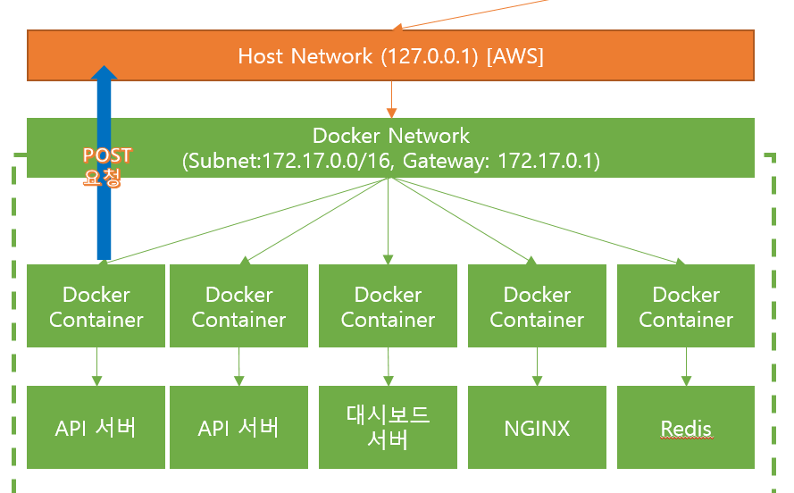

# Introduction

This gateway project allows you to send a post request to a localhost in the docker container. to use this project, you need to call a command in your linux terminal, as follows:

<p align="center">

</p>

```sh
ip route | grep docker0 | awk '{print $9}'
```

as above command will return the ip address of the docker0 interface such as `172.17.0.1`, or you can also use the command below to get the docker0 ip address:

```sh
sudo docker network inspect bridge | grep Gateway | awk '{print $2}'
```

you should need to replace gateway address in the file named `app.controller.ts`, as follows:

```ts
  @Post('/webhook')
  async webhook(@Req() req: Request, @Body() body: any) {
    const gateway = '172.17.0.1'; // replace this address as you want.
    const port = '3000'; // replace this port as you want.

    const url = `http://${gateway}:${port}/webhook`; // replace this address as you want
    const options = <AxiosRequestConfig>{
      method: 'POST', // replace this method as you want.
      headers: req.headers,
    };
    const response = await this.httpService
      .post(url, body, options)
      .toPromise();

    return response.data;
  }
```

I didn't use files such as `app.service.ts`, `.env`, `.env` file is pretty useful however, to use this file, you should need to install an additional node package such as `npm i --save @nestjs/config`. Howerver, In this project, it didn't use a module named `ConfigModule` and injectable service named `ConfigService`.

# workflow test

```text
test1
test2
test3
test4
test5
```
